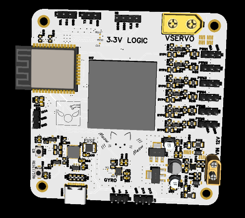
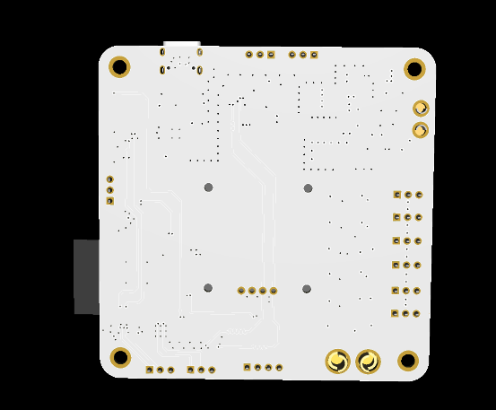

# Bike active aero handler
this project is made for the **Hermes YSWS**  
*Bike active aero handler* is a PCB which gets power from the bike's battery and based on the lean of the bike, which is obtained with the *BMI160* gyroscope controlls the active winglets moved by the 6 servomotors connected via the PWM pins 

## The PCB

